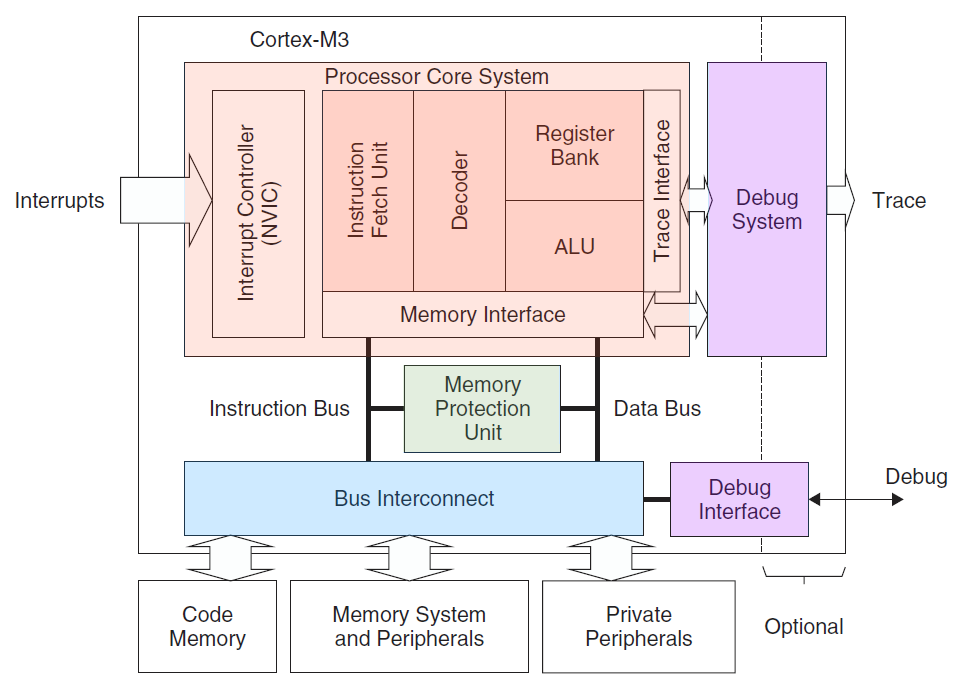

# 目录

## arm内核发展历史

arm7 cortex-m0 cortex-m3 cortex-m4 cortex-m7 arm9 arm11 arm12 cortex-a7 cortex-a9 cortex-a11 cortex-a52

cortex系列属于armv7架构

armv7A  cortex-A系列
cortex-A系列有 ARM7 ARM9 ARM11 cortex-A5 cortex-A7 cortex-A8 cortex-A9 cortex-A15 cortex-A17 cortex-A53 cortex-A57 cortex-A72
A53和A57，A72属于armv8架构

cortex-M系列有M0 M0+ M3 M4 M7

cortex-M0只支持thumb指令集

## cortex-M系列芯片系统框图

中断控制器 M内核 AHB总线 存储器和外设 电源管理 时钟树

## 通用寄存器
R0 R1 R2 R3 R4 R5 R6 R7 R8 R9 R10 R11 R12 

## 特殊寄存器
SP(R13) LR(R14) PC(R15) CONTROL xPSR PRIMASK

## MSP和PSP
msp中断中会使用，psp用于线程栈使用，通过配置CONTROL寄存器切换。

## xPSR
IPSR可以用来判断当前处于什么中断。

## PRIMASK
中断屏蔽寄存器，写1屏蔽所有中断(除了不可屏蔽中断和hardfault)

## CONTROL
第1bit写1表示切换成PSP
系统复位后默认使用msp，中断中也使用msp。

## 栈空间操作
通过CONTROL寄存器决定使用msp还是psp
栈向下递减
栈指针始终指向栈的最后一个数据，每次执行数据存储前(push)，SP会首先j减小

## 异常和中断
m0最多支持32个外部中断
### 系统异常
> 主要用于操作系统和错误处理

异常类型   异常编号   说明
reset        1     上电复位、系统复位
NMI          2     不可屏蔽中断
hardfault    3     硬件错误
SVCall       11    系统调用
PendSV       13    挂起系统调用
systick      15    系统滴答

## NVIC 可嵌套向量z中断控制器
中断可嵌套
相同优先级的中断不可嵌套
相同中断不可嵌套

## 系统控制块SCB
实际上是许多的系统管理的寄存器
jtag 或swd调试接口

## cortex-m0启动流程
程序从0x00000000地址开始执行
程序bin文件的开始处为中断向量表，向量表大小由实际使用的irq来决定。
sp指针 resetHandler地址 NMI地址 hardfault地址 。。。

## 大小端
m0支持大端模式和小端模式，不过一般芯片公司选择小端模式。

## 堆栈
堆向上增长
栈向下增长

## 压栈过程

xPSR
PC
LR
R12
R3
R2
R1
R0

## 中断向量表

## 杂项指令集
BKPT        断点
CPSID       关闭总中断
CPSIE       打开总中断
DMB         数据存储器隔离 仅当所有在它前面的存储器访问操作都执行完毕后，才开始后面的存储器访问操作
DSB         数据同步隔离，比DMB更严格:仅当所有在它前面的存储器访问操作都执行完毕后，才开始后面的指令
ISB         指令同步隔离，最严格: 会清洗流水线，保证所有它前面的指令都执行完毕之后，才执行后面的指令。
MRS         从特殊寄存器读取数据到通用寄存器
MSR         从通用寄存器读取数据到特殊寄存器
NOP         空转指令
SEV         产生event
SVC         产生SVC系统调用中断
WFE         等待event
WFI         等待中断

#系统操作寄存器

0xE000E008 - 0xE000E00F System Control Block Table
0xE000E010 - 0xE000E01F Reserved -
0xE000E010 - 0xE000E01F SysTick system timer
0xE000E100 - 0xE000E4EF Nested Vectored Interrupt Controller 
0xE000ED00 - 0xE000ED3F System Control Block 
0xE000EF00 - 0xE000EF03 Nested Vectored Interrupt Controller

### Nested Vectored Interrupt Controller 
0xE000E100 ISER Interrupt Set-enable Register
0xE000E180 ICER Interrupt Clear-enable Register
0xE000E200 ISPR Interrupt Set-pending Register
0xE000E280 ICPR Interrupt Clear-pending Register
0xE000E400 - 0xE000E41C IPR0-7 Interrupt Priority Registers

### System Control Block
0xE000ED00 CPUID CPUID Register
0xE000ED04 ICSR Interrupt Control and State Register 
0xE000ED0C AIRCR Application Interrupt and Reset Control Register
0xE000ED10 SCR System Control Register
0xE000ED14 CCR Configuration and Control Register
0xE000ED1C SHPR2 System Handler Priority Register 2
0xE000ED20 SHPR3  System Handler Priority Register 3

### SysTick system timer
0xE000E010 SYST_CSR SysTick Control and Status Register
0xE000E014 SYST_RVR SysTick Reload Value Register
0xE000E018 SYST_CVR SysTick Current Value Register
0xE000E01C SYST_CALIB SysTick Calibration Value Register

## M0 M3 M4 M7区别
M0 armv6-M架构

M3 armv7-M架构
多了basepri寄存器可以阻止某优先级或更低的优先级的中断。
faultmask寄存器提供了更多的错误管理特性。
CONTROL寄存器的bit0用于决定是特权模式还是用户线程模式
32为thumb指令
位段特性
位域处理
多处理器支持
最多240个中断
硬件除法
存储器保护单元
更多的调试和跟踪特性

M4 armv7-M架构
浮点特性
SIMD指令(单周期多指令)
饱和算法
单周期MAC(MAC乘法累加)

## M3系统框图

## primask
屏蔽所有的fault (NMI不受影响和hardfault不受影响)
## faultmask
屏蔽所有的fault (NMI不受影响)

## BASEPRI
屏蔽所有优先级不高于某个具体数值的中断

## M3快速开关中断

CPSID I ;PRIMASK=1,;关中断
CPSIE I ;PRIMASK=0, ;开中断
CPSID F ;FAULTMASK=1, ;关异常
CPSIE F ;FAULTMASK=0 ;开异常

## CONTROL
位           功能
CONTROL[1]  堆栈指针选择 
0=选择主堆栈指针 MSP(复位后缺省值) 
1=选择进程堆栈指针 PSP 
在线程或基础级(没有在响应异常——译注),可以使用 PSP。在 handler 模式下,
只允许使用 MSP,所以此时不得往该位写 1。 
CONTROL[0]  0=特权级的线程模式 
1=用户级的线程模式 
Handler 模式永远都是特权级的。 

## 异常和中断
Cortex‐M3 支持大量异常,包括 16‐4‐1=11 个系统异常,和最多 240 个外部中断——简
称 IRQ。

编号 类型 优先级 简介
0 N/A N/A 没有异常在运行
1 复位 -3(最高) 复位
2 NMI -2 不可屏蔽中断(来自外部 NMI 输入脚)
3 硬(hard) fault -1 所有被除能的 fault,都将“上访”成硬 fault。除能的原因包括
当前被禁用,或者 FAULTMASK 被置位。
4
MemManage
可编程
fault
5
存储器管理 fault,MPU 访问犯规以及访问非法位置均可引发。
企图在“非执行区”取指也会引发此 fault
总线 fault
可编程
从总线系统收到了错误响应,原因可以是预取流产(Abort)或
数据流产,或者企图访问协处理器
6
用法(usage)
可编程
Fault
由于程序错误导致的异常。通常是使用了一条无效指令,或者是
非法的状态转换,例如尝试切换到 ARM 状态
7-10 保留 N/A N/A
11 SVCall 可编程 执行系统服务调用指令(SVC)引发的异常
12 调试监视器 可编程 调试监视器(断点,数据观察点,或者是外部调试请求
13 保留 N/A N/A
14 PendSV 可编程 为系统设备而设的“可悬挂请求”(pendable request)
15 SysTick 可编程 系统滴答定时器(也就是周期性溢出的时基定时器——译注)
16 IRQ #0 可编程 外中断#0
17 IRQ #1 可编程 外中断#1
...  ...  ...  ... 
255  IRQ #239  可编程  外中断#239 
## MPU存储器保护单元
Cortex‐M3 有一个可选的存储器保护单元。配上它之后,就可以对特权级访问和用户级访问分
别施加不同的访问限制。当检测到犯规(violated)时,MPU 就会产生一个 fault 异常,可以由 fault
异常的服务例程来分析该错误,并且在可能时改正它。 
 
MPU 有很多玩法。最常见的就是由操作系统使用 MPU,以使特权级代码的数据,包括操作系
统本身的数据不被其它用户程序弄坏。MPU 在保护内存时是按区管理的(“区”的原文是 region,以
后不再中译此名词——译注)。它可以把某些内存 region 设置成只读,从而避免了那里的内容意外被
更改;还可以在多任务系统中把不同任务之间的数据区隔离。一句话,它会使嵌入式系统变得更加
健壮,更加可靠(很多行业标准,尤其是航空的,就规定了必须使用 MPU 来行使保护职能——译
注)。