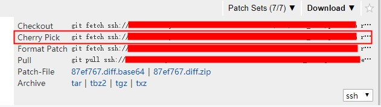

## git 使用说明
git操作笔记，初级使用教程请参考 [git cheatsheet](#git-cheatsheet) 。

### 添加文件
```sh
git add .
```
### 删除文件
```sh
git rm .
```
### 提交改动到本地
```sh
git commit -m "first commit"
```
### 上传改动到服务器
```sh
git push
```
### 列出当前分支
```sh
git branch
```
### 列出所有分支，包括远程分支
```sh
git branch -a
```
### 从已有的分支创建新的分支(如从master分支),创建一个dev分支
```sh
git checkout -b dev
```
### 从服务器拉取分支到本地分支
```sh
git pull origin gh-pages:gh-pages
```
> 需要本地没有gh-pages分支，否则会提示已拒绝
### 上传本地分支到远程分支
```sh
git branch --set-upstream-to=gh-pages
git push origin gh-pages
```

## gerrit

如何修改一个commit：

1. 先在一个干净的repo里面把这一个commit 拉取下来：

```sh
git fetch ssh://xxx@xxxx/xxx/xxx refs/changes/20/190820/6 && cherry-pick FETCH_HEAD
```
具体指令需要看gerrit网页右上角：



此时`git status` 当前是有y一个commit的，`git log`也能看到log。

2. 修改代码，然后提交到本地。

```sh
git add
#使用 --amend 重新更新这个commit信息。
git commit --amend
```

3. push到gerrit

> 需要指定具体push到哪个id

```sh
git push origin HEAD:refs/changes/<change id>
```

## 附录

### git cheatsheet


> [Gitlab](http://gitlab.com/) 官方提供的 git cheatsheet 。