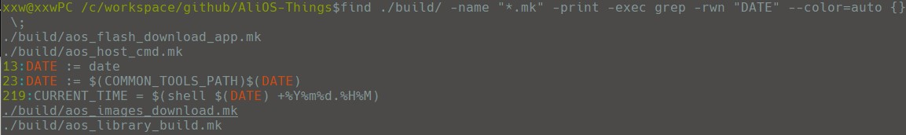
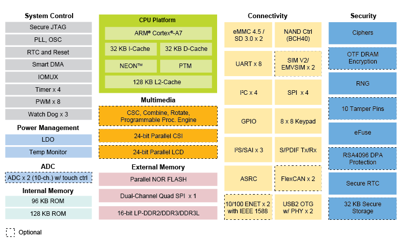

# 目录
* [关键命令说明](#关键命令说明)
    * [系统关机命令](#系统关机命令)
    * [linux查看文本的指令](#linux查看文本的指令)
    * [mount](#mount指令)
    * [dmesg](#dmesg)
    * [grep](#grep)
    * [find](#find)
    * [lsusb](#lsusb)
    * [lsof](#lsof)
* [linux软件开发知识点](#linux软件开发知识点)
    * [linux进程间通讯方式](#linux进程间通讯方式)
    * [内存申请函数](#内存申请函数)
    * [gcc编译过程](#gcc编译过程)
    * [文件系统](#文件系统)
    * [硬链接和软连接](#硬链接和软连接)
    * [linux内核子系统](#linux内核子系统)
    * [进程几种状态](#进程几种状态)
    * [文件系统组成](#文件系统组成)
    * [linux文件类型](#linux文件类型)
    * [linux常用的系统调用函数](#linux常用的系统调用函数)
    * [fork函数](#fork函数)
    * [僵尸进程](#僵尸进程)
    * [常见文件说明](#常见文件说明)
    * [/proc目录说明](#/proc目录说明)
    * [fopen参数说明](#fopen参数说明)
* [linux驱动开发知识点](#linux驱动开发知识点)
* [makefile](#makefile)
* [shell](#shell)

## 关键命令说明
* [系统关机命令](#系统关机命令)
* [linux查看文本的指令](#linux查看文本的指令)
* [mount](#mount指令)
* [dmesg](#dmesg)
* [grep](#grep)
* [find](#find)
* [lsusb](#lsusb)
* [lsof](#lsof)

### 系统关机命令
|指令|说明|
|:-:|----|
|shutdown | 命令安全地将系统关机。|
|halt     | 就是调用shutdown -h。|
|reboot   | 工作过程差不多跟halt一样﹐不过它是引发主机重启|
|poweroff | 就是halt的软链接而已|
|init     | 所有进程的祖先﹐它的进程号始终为1﹐init 0为关机﹐init1为重启。|

### linux查看文本的指令
<table style="text-align:center">
   <tr>
      <td>cat</td>
      <td>tac</td>
      <td>sed</td>
      <td>head</td>
      <td>tail</td>
      <td>more</td>
      <td>less</td>
      <td>nl</td>
   </tr>
</table>

> <strong>tac</strong>： cat的反向指令，从最后一行倒序显示全部内容
> <strong>head</strong>： 只显示头几行
> <strong>tail</strong>： 只显示最后几行 tail -f 可以实时显示log文件的更新
> <strong>nl</strong>： 类似于cat -n，显示时输出行号

### mount
命令格式：
```sh
mount [-t vfstype] [-o options] device dir
```
挂载nfs
```sh
mount -t nfs 192.168.0.1:/tmp /mnt/nfs 
```
### dmesg
```sh
cat /var/log/messages
```

### grep
选项
```sh
-c：只输出匹配行的计数。
-C：匹配的上下文分别显示[number]行。
-I：不区分大小写(只适用于单字符)。
-i：不区分大小写。
-h：查询多文件时不显示文件名。
-l：查询多文件时只输出包含匹配字符的文件名。
-L：列出不匹配的文件名。
-n：显示匹配行及 行号。
-s：不显示不存在或无匹配文本的错误信息。
-v：显示不包含匹配文本的所有行。
-w：只匹配整个单词。
-E：扩展的正则表达式
-R：递归搜寻
--exclude=FILE：跳过FILE
```
正则表达式主要参数：
	\：忽略正则表达式中特殊字符的原有含义。
	^：匹配正则表达式的开始行。
	$：匹配正则表达式的结束行。
	\<：从匹配正则表达式的行开始。
	\>：到匹配正则表达式的行结束。
	[]：单个字符，如[A]即A符合要求 。
	[-]：范围，如[A-Z]，即A、B、C一直到Z都符合要求 。
	.：所有的单个字符。
	*：有字符，长度可以为0。


经典使用方法
```sh
#所有以d开头的文件，包含test的匹配行
grep "test" d*
#包含test或者zephyr 不区分大小写 显示行号 扩展正则表达式
grep -inE "test|zephyr" d*
#包含test和zephyr 不区分大小写 显示行号 扩展正则表达式
grep -in "test" d* | grep 'zephyr'
```

主要参数：
	－c：只输出匹配行的计数。
	－I：不区分大小写(只适用于单字符)。
	－h：查询多文件时不显示文件名。
	－l：查询多文件时只输出包含匹配字符的文件名。
	－L：列出不匹配的文件名
	－n：显示匹配行及行号。
	－s：不显示不存在或无匹配文本的错误信息。
	－v：显示不包含匹配文本的所有行。
	－R：递归搜寻
	－d skip：不递归搜寻
	－w：匹配整个单词
正则表达式主要参数：
	\：忽略正则表达式中特殊字符的原有含义。
	^：匹配正则表达式的开始行。
	$：匹配正则表达式的结束行。
	\<：从匹配正则表达式的行开始。
	\>：到匹配正则表达式的行结束。
	[]：单个字符，如[A]即A符合要求 。
	[-]：范围，如[A-Z]，即A、B、C一直到Z都符合要求 。
	.：所有的单个字符。
	*：有字符，长度可以为0。

grep 'test' d*		显示以d开头的文件中包含的test行
grep 'test' aa bb cc 	查找文件aa bb cc 中匹配的test行
grep 'test'|'hello' files 匹配test或者hello
grep '\<man' files	匹配manic 和man 不匹配batman
grep '\<man\>'		只匹配man 不匹配batman和manic
grep '^man' files	匹配的字符行首
grep '$man' files	匹配的字符串仔行尾

### find
用法
```sh
find [-path ..] [expression]
```
选项
```sh
-name     按照文件名
-iname     按照文件名 忽略大小写
-perm     按照文件权限
-user     按照文件拥有者
-group    按照文件所属的组
-mtime -n +n 按照文件的更改时间来查找文件， -n：n天以内，+n：n天以前
-type     查找某一类型：文件类型有：普通文件(f)，目录(d)，字符设备文件(c)，块设备文件(b)，符号链接文件(l)，套接字文件(s)，管道文件(p)
-size n   查找文件长度为n块（一块等于512字节）的文件，带有c时表示文件长度以字节计。 
-mount    不跨越文件系统
-follow   遇到符号链接文件，就跟踪至链接所指向的文件
-path     匹配文件路径或者文件
-exec     执行后续命令操作
-a        and 与操作
-o        or  或操作
-not      not 非操作
```
经典使用方法
```sh
#查找/run中所有的socket文件
find /run -type s
#搜索/dev中所有包含tty的文件
find /dev -name "*tty*"
#搜索/dev中大小大于10字节，名称包含bus的文件
find /dev -size +10c -name "*bus*"
#或操作，搜索debug开头的文件或者.rst的文件
find -name 'debug*' -o -name '*.rst'
#与操作，搜索debug开头的文件同时是.rst的文件
find -name 'debug*' -a -name '*.rst'
#找出文件大小大于10000块的文件，并复制到当前目录
find -size +100000 -exec cp {} . \;
```

高级使用方法

##### 查询所有mk文件中的date文本

```sh
find ./build/ -name "*.mk" -print -exec grep -rwn "date" --color=auto {} \;
```



### lsusb
显示系统中以及连接到系统的USB总线信息的工具。
```sh
$ lsusb

Bus 001 Device 001: ID 1d6b:0002 Linux Foundation 2.0 root hub
Bus 002 Device 001: ID 1d6b:0002 Linux Foundation 2.0 root hub
Bus 003 Device 001: ID 1d6b:0001 Linux Foundation 1.1 root hub
Bus 004 Device 001: ID 1d6b:0001 Linux Foundation 1.1 root hub
Bus 005 Device 001: ID 1d6b:0001 Linux Foundation 1.1 root hub
Bus 006 Device 001: ID 1d6b:0001 Linux Foundation 1.1 root hub
Bus 007 Device 001: ID 1d6b:0001 Linux Foundation 1.1 root hub
Bus 008 Device 001: ID 1d6b:0001 Linux Foundation 1.1 root hub
Bus 002 Device 003: ID 17ef:4811 Lenovo Integrated Webcam [R5U877]
Bus 008 Device 002: ID 0a5c:217f Broadcom Corp. Bluetooth Controller
```
> Bus 008 : 指明设备连接到哪（哪条总线）
> Device 002 : 表明这是连接到总线上的第二台设备
> ID : 设备的ID
> Broadcom Corp. Bluetooth Controller :生产商名字和设备名

列出USB详细信息
```sh
$ lsusb -v
```
列出有多少USB设备
```sh
$ find /dev/bus
```
打印特定设备的详细信息
```sh
$ lsusb -D /dev/bus/usb/008/002
```
### lsof
列出当前系统打开文件的工具
```sh
$ sudo lsof
COMMAND    PID      USER   FD      TYPE     DEVICE     SIZE       NODE      NAME
init       1         root  cwd      DIR       3,3       1024       2         /
init       1         root  rtd      DIR       3,3       1024       2         /
init       1         root  txt      REG       3,3       38432      1763452  /sbin/init
init       1         root  mem      REG       3,3       106114     1091620  /lib/libdl-2.6.so
init       1         root  mem      REG       3,3       7560696    1091614  /lib/libc-2.6.so
init       1         root  mem      REG       3,3       79460      1091669  /lib/libselinux.so.1
init       1         root  mem      REG       3,3       223280     1091668  /lib/libsepol.so.1
init       1         root  mem      REG       3,3       564136     1091607  /lib/ld-2.6.so
init       1         root  10u      FIFO      0,15                  1309     /dev/initctl
```

<table style="text-align:center">
   <tr>
      <td>COMMAND</td>
      <td>进程的名称</td>
      <td></td>
   </tr>
   <tr>
      <td>PID</td>
      <td>进程标识符</td>
      <td></td>
   </tr>
   <tr>
      <td>USER</td>
      <td>进程所有者</td>
      <td></td>
   </tr>
   <tr>
      <td>FD</td>
      <td>文件描述符</td>
      <td>应用程序通过文件描述符识别该文件。如cwd、txt、mem等</td>
   </tr>
   <tr>
      <td>TYPE</td>
      <td>文件类型</td>
      <td>REG(文件) DIR(目录) CHR(字符) BLK(块设备) FIFO(管道) UNIX(UNIX 域套接字) IPv4(IP套接字)</td>
   </tr>
   <tr>
      <td>DEVICE</td>
      <td>指定磁盘的名称</td>
      <td></td>
   </tr>
   <tr>
      <td>SIZE</td>
      <td>文件大小</td>
      <td></td>
   </tr>
   <tr>
      <td>NODE</td>
      <td>文件inode</td>
      <td>每个文件都有一个唯一的inode</td>
   </tr>
   <tr>
      <td>NAME</td>
      <td>文件名称</td>
      <td></td>
   </tr>
</table>

参数列表
```sh
lsof  filename      显示打开指定文件的所有进程
lsof -a             表示两个参数都必须满足时才显示结果
lsof -c string      显示COMMAND列中包含指定字符的进程所有打开的文件
lsof -u username    显示所属user进程打开的文件
lsof -g gid         显示归属gid的进程情况
lsof +d /DIR/       显示目录下被进程打开的文件
lsof +D /DIR/       同上，但是会搜索目录下的所有目录，时间相对较长
lsof -d FD          显示指定文件描述符的进程
lsof -n             不将IP转换为hostname，缺省是不加上-n参数
lsof -i             用以显示符合条件的进程情况
lsof -i[46] [protocol][@hostname|hostaddr][:service|port]
                    46 --> IPv4 or IPv6
                    protocol --> TCP or UDP
                    hostname --> Internet host name
                    hostaddr --> IPv4地址
                    service --> /etc/service中的 service name (可以不只一个)
                    port --> 端口号 (可以不只一个)
```
查找应用程序打开的文件的名称和数目
```sh
#显示打开指定文件的所有进程
$ lsof  filename
#例如:打开所有使用/dev/urandom的进程
$ lsof /dev/urandom
#查看22端口现在运行的情况 
$ lsof -i :22
#查看所属xiaxiaowen用户进程所打开的文件类型为txt的文件
$ lsof -a -u xiaxiaowen -d txt
#查找谁在使用文件系统
$ lsof /media/xiaxiaowen/机械硬盘
COMMAND  PID       USER   FD   TYPE DEVICE SIZE/OFF NODE NAME
zsh     8465 xiaxiaowen  cwd    DIR   8,17     8192    5 /media/xiaxiaowen/机械硬盘
```

## linux软件开发知识点
* [linux进程间通讯方式](#linux进程间通讯方式)
* [内存申请函数](#内存申请函数)
* [linux内存分配说明](#linux内存分配说明)
* [gcc编译过程](#gcc编译过程)
* [文件系统](#文件系统)
* [硬链接和软连接](#硬链接和软连接)
* [linux内核子系统](#linux内核子系统)
* [进程几种状态](#进程几种状态)
* [文件系统组成](#文件系统组成)
* [linux文件类型](#linux文件类型)
* [linux常用的系统调用函数](#linux常用的系统调用函数)
* [fork函数](#fork函数)
* [僵尸进程](#僵尸进程)
* [常见文件说明](#常见文件说明)
* [proc目录说明](#proc目录说明)
* [fopen参数说明](#fopen参数说明)

### linux进程间通讯方式
1. 管道（Pipe）及有名管道（named pipe）
2. 信号（Signal）
3. 报文（Message）队列（消息队列）：
4. 共享内存
5. 信号量（semaphore）
6. 套接口（Socket）

### 内存申请函数
1. calloc
2. malloc
3. realloc
### linux内存分配说明
|内存|存放数据|说明|
|:---:|---|---|
|静态存储区|静态数据、全局数据、常量|在程序编译的时候就已经分配好|
|栈区     |局部变量、函数参数|栈内存分配运算内置于处理器的指令集中，效率很高，但是分配的内存容量有限|
|堆区     |malloc申请的内存|动态内存分配,需要手动释放|
|代码区    |代码|存放函数体的二进制代码|
|文字常量区|常量字符串|程序结束后由系统释放|
### gcc编译过程

<table style="text-align:center">
   <tr>
      <td><strong>过程</td>
      <td><strong>生成文件</td>
   </tr>
   <tr>
      <td>预编译</td>
      <td>*.i</td>
   </tr>
   <tr>
      <td>编译</td>
      <td>*.s</td>
   </tr>
   <tr>
      <td>汇编</td>
      <td>*.o</td>
   </tr>
   <tr>
      <td>链接</td>
      <td>可执行文件</td>
   </tr>
</table>

### 文件系统

<table style="text-align:center">
   <tr>
      <td>fat</td>
      <td>fat32</td>
      <td>ntfs</td>
      <td>ext2</td>
      <td>ext3</td>
      <td>ext4</td>
      <td>nfs</td>
   </tr>
</table>

### 硬链接和软连接
#### 硬链接
* 硬链接直接指向文件的i节点
* 硬链接和原文件的i节点是一样的
* 硬链接文件显示的大小是跟原文件是一样的
* 硬链接不能链接目录文件。
```sh
ln file2 /home/xiaxiaowen/file2hard
```
#### 软链接(符号链接)
* 软链接则是建立了一个新文件
* 这个文件指向链接的文件，i节点不一样
* 可以链接目录
```sh
ln -s file2 /home/xiaxiaowen/file2soft
```

### linux内核子系统
1. 进程管理
2. 内存管理
3. I/O管理
4. 文件系统管理

### 进程几种状态
1. 运行态
2. 就绪态
3. 阻塞态

### 文件系统组成
1. <strong>超级块</strong>：存放文件系统本身的信息，比如记录了每个区域的大小，或未被使用的磁盘块的信息。（不同版本稍有差别）
2. <strong>i-节点表</strong>：每个文件都有其属性，大小，最近修改时间等等，这些被存储在ino_t 的结构体中，所有的i-节点都有一样的大小，i-节点表就是这样一些节点的列表。（表中的每个i-节点都通过位置来标志，例如标志为2的i-节点位于文件系统i-节点表中的第3个位置 ）
3. <strong>数据块</strong>：存放文件内容，因为块的大小一定，所以有时一个文件会分布在多个磁盘上。
### i 节点
i 节点是一个64字节长的表,表中包含了文件的相关信息,其中有文件的大小、文件所有者、文件的存取许可方式以及文件的类型等重要信息.

### linux文件类型
<table style="text-align:center">
   <tr>
      <td><strong>文件类型</strong></td>
      <td>普通文件</td>
      <td>目录</td>
      <td>字符设备文件</td>
      <td>块设备文件</td>
      <td>符号链接文件</td>
      <td>套接字文件</td>
      <td>管道文件</td>
   </tr>
   <tr>
      <td><strong>属性</strong></td>
      <td>-</td>
      <td>d</td>
      <td>c</td>
      <td>b</td>
      <td>l</td>
      <td>s</td>
      <td>p</td>
   </tr>
</table>

### linux常用的系统调用函数
* [进程控制函数](#进程控制函数)
* [文件操作函数](#文件操作函数)
* [文件系统操作函数](#文件系统操作函数)
* [系统控制函数](#系统控制函数)
* [内存管理函数](#内存管理函数)
* [网络管理函数](#网络管理函数)
* [socket函数](#socket函数)
* [用户管理函数](#用户管理函数)
* [进程间通信函数](#进程间通信函数)
* [信号相关函数](#信号相关函数)
* [消息相关函数](#消息相关函数)
* [管道相关函数](#管道相关函数)
* [信号量相关函数](#信号量相关函数)
* [共享内存相关函数](#共享内存相关函数)

#### 进程控制函数
<table>
   <tr style="color:red">
      <td>fork</td>
      <td>创建一个新进程</td>
   </tr>
   <tr style="color:red">
      <td>clone</td>
      <td>按指定条件创建子进程</td>
   </tr>
   <tr style="color:red">
      <td>execve</td>
      <td>运行可执行文件</td>
   </tr>
   <tr style="color:red">
      <td>exit</td>
      <td>中止进程</td>
   </tr>
   <tr>
      <td>_exit</td>
      <td>立即中止当前进程</td>
   </tr>
   <tr>
      <td>getdtablesize</td>
      <td>进程所能打开的最大文件数</td>
   </tr>
   <tr>
      <td>getpgid</td>
      <td>获取指定进程组标识号</td>
   </tr>
   <tr>
      <td>setpgid</td>
      <td>设置指定进程组标志号</td>
   </tr>
   <tr>
      <td>getpgrp</td>
      <td>获取当前进程组标识号</td>
   </tr>
   <tr>
      <td>setpgrp</td>
      <td>设置当前进程组标志号</td>
    </tr>
      <tr style="color:red">
          <td>getpid</td>
          <td>获取进程标识号</td>
    </tr>
      <tr>
          <td>getppid</td>
          <td>获取父进程标识号</td>
    </tr>
      <tr style="color:red">
          <td>getpriority</td>
          <td>获取调度优先级</td>
    </tr>
      <tr style="color:red">
          <td>setpriority</td>
          <td>设置调度优先级</td>
    </tr>
      <tr>
          <td>modify_ldt</td>
          <td>读写进程的本地描述表</td>
    </tr>
      <tr>
          <td>nanosleep</td>
          <td>使进程睡眠指定的时间</td>
    </tr>
      <tr>
          <td>nice</td>
          <td>改变分时进程的优先级</td>
    </tr>
      <tr style="color:red">
          <td>pause</td>
          <td>挂起进程，等待信号</td>
    </tr>
      <tr>
          <td>personality</td>
          <td>设置进程运行域</td>
    </tr>
      <tr style="color:red">
          <td>prctl</td>
          <td>对进程进行特定操作</td>
    </tr>
      <tr>
          <td>ptrace</td>
          <td>进程跟踪</td>
    </tr>
      <tr>
          <td>sched_get_priority_max</td>
          <td>取得静态优先级的上限</td>
    </tr>
      <tr>
          <td>sched_get_priority_min</td>
          <td>取得静态优先级的下限</td>
    </tr>
      <tr>
          <td>sched_getparam</td>
          <td>取得进程的调度参数</td>
    </tr>
      <tr>
          <td>sched_getscheduler</td>
          <td>取得指定进程的调度策略</td>
    </tr>
      <tr>
          <td>sched_rr_get_interval</td>
          <td>取得按RR算法调度的实时进程的时间片长度</td>
    </tr>
      <tr>
          <td>sched_setparam</td>
          <td>设置进程的调度参数</td>
    </tr>
      <tr>
          <td>sched_setscheduler</td>
          <td>设置指定进程的调度策略和参数</td>
    </tr>
      <tr>
          <td>sched_yield</td>
          <td>进程主动让出处理器,并将自己等候调度队列队尾</td>
    </tr>
      <tr>
          <td>vfork</td>
          <td>创建一个子进程，以供执行新程序，常与execve等同时使用</td>
    </tr>
      <tr style="color:red">
          <td>wait</td>
          <td>等待子进程终止</td>
    </tr>
      <tr>
          <td>wait3</td>
          <td>参见wait</td>
    </tr>
      <tr>
          <td>waitpid</td>
          <td>等待指定子进程终止</td>
    </tr>
      <tr>
          <td>wait4</td>
          <td>参见waitpid</td>
    </tr>
      <tr>
          <td>capget</td>
          <td>获取进程权限</td>
    </tr>
      <tr>
          <td>capset</td>
          <td>设置进程权限</td>
    </tr>
      <tr>
          <td>getsid</td>
          <td>获取会晤标识号</td>
    </tr>
      <tr>
          <td>setsid</td>
          <td>设置会晤标识号</td>
      </tr>
</table>

#### 文件操作函数

<table>
  <tr style="color:red">
      <td>fcntl</td>
      <td>文件控制</td>
  </tr>
  <tr style="color:red">
      <td>open</td>
      <td>打开文件</td>
  </tr>
  <tr style="color:red">
      <td>creat</td>
      <td>创建新文件</td>
  </tr>
  <tr style="color:red">
      <td>close</td>
      <td>关闭文件描述字</td>
  </tr>
  <tr style="color:red">
      <td>read</td>
      <td>读文件</td>
  </tr>
  <tr style="color:red">
      <td>write</td>
      <td>写文件</td>
  </tr>
  <tr>
      <td>readv</td>
      <td>从文件读入数据到缓冲数组中</td>
  </tr>
  <tr>
      <td>writev</td>
      <td>将缓冲数组里的数据写入文件</td>
  </tr>
  <tr>
      <td>pread</td>
      <td>对文件随机读</td>
  </tr>
  <tr>
      <td>pwrite</td>
      <td>对文件随机写</td>
  </tr>
  <tr style="color:red">
      <td>lseek</td>
      <td>移动文件指针</td>
  </tr>
  <tr>
      <td>_llseek</td>
      <td>在64位地址空间里移动文件指针</td>
  </tr>
  <tr>
      <td>dup</td>
      <td>复制已打开的文件描述字</td>
  </tr>
  <tr>
      <td>dup2</td>
      <td>按指定条件复制文件描述字</td>
  </tr>
  <tr style="color:red">
      <td>flock</td>
      <td>文件加/解锁</td>
  </tr>
  <tr style="color:red">
      <td>poll</td>
      <td>I/O多路转换</td>
  </tr>
  <tr>
      <td>truncate</td>
      <td>截断文件</td>
  </tr>
  <tr>
      <td>ftruncate</td>
      <td>参见truncate</td>
  </tr>
  <tr>
      <td>umask</td>
      <td>设置文件权限掩码</td>
  </tr>
  <tr style="color:red">
      <td>fsync</td>
      <td>把文件在内存中的部分写回磁盘</td>
  </tr>
</table>

#### 文件系统操作函数

<table>
  <tr style="color:red">
      <td>access</td>
      <td>确定文件的可存取性</td>
  </tr>
  <tr style="color:red">
      <td>chdir</td>
      <td>改变当前工作目录</td>
  </tr>
  <tr>
      <td>fchdir</td>
      <td>参见chdir</td>
  </tr>
  <tr style="color:red">
      <td>chmod</td>
      <td>改变文件方式</td>
  </tr>
  <tr>
      <td>fchmod</td>
      <td>参见chmod</td>
  </tr>
  <tr>
      <td>chown</td>
      <td>改变文件的属主或用户组</td>
  </tr>
  <tr>
      <td>fchown</td>
      <td>参见chown</td>
  </tr>
  <tr>
      <td>lchown</td>
      <td>参见chown</td>
  </tr>
  <tr style="color:red">
      <td>chroot</td>
      <td>改变根目录</td>
  </tr>
  <tr style="color:red">
      <td>stat</td>
      <td>取文件状态信息</td>
  </tr>
  <tr>
      <td>lstat</td>
      <td>参见stat</td>
  </tr>
  <tr>
      <td>fstat</td>
      <td>参见stat</td>
  </tr>
  <tr style="color:red">
      <td>statfs</td>
      <td>取文件系统信息</td>
  </tr>
  <tr>
      <td>fstatfs</td>
      <td>参见statfs</td>
  </tr>
  <tr style="color:red">
      <td>readdir</td>
      <td>读取目录项</td>
  </tr>
  <tr>
      <td>getdents</td>
      <td>读取目录项</td>
  </tr>
  <tr style="color:red">
      <td>mkdir</td>
      <td>创建目录</td>
  </tr>
  <tr style="color:red">
      <td>mknod</td>
      <td>创建索引节点</td>
  </tr>
  <tr style="color:red">
      <td>rmdir</td>
      <td>删除目录</td>
  </tr>
  <tr style="color:red">
      <td>rename</td>
      <td>文件改名</td>
  </tr>
  <tr style="color:red">
      <td>link</td>
      <td>创建链接</td>
  </tr>
  <tr style="color:red">
      <td>symlink</td>
      <td>创建符号链接</td>
  </tr>
  <tr style="color:red">
      <td>unlink</td>
      <td>删除链接</td>
  </tr>
  <tr>
      <td>readlink</td>
      <td>读符号链接的值</td>
  </tr>
  <tr>
      <td>mount</td>
      <td>安装文件系统</td>
  </tr>
  <tr>
      <td>umount</td>
      <td>卸下文件系统</td>
  </tr>
  <tr style="color:red">
      <td>ustat</td>
      <td>取文件系统信息</td>
  </tr>
  <tr>
      <td>utime</td>
      <td>改变文件的访问修改时间</td>
  </tr>
  <tr>
      <td>utimes</td>
      <td>参见utime</td>
  </tr>
  <tr>
      <td>quotactl</td>
      <td>控制磁盘配额</td>
  </tr>
</table>

#### 系统控制函数

<table>
  <tr style="color:red">
      <td>ioctl</td>
      <td>I/O总控制函数</td>
  </tr>
  <tr>
      <td>_sysctl</td>
      <td>读/写系统参数</td>
  </tr>
  <tr>
      <td>acct</td>
      <td>启用或禁止进程记账</td>
  </tr>
  <tr>
      <td>getrlimit</td>
      <td>获取系统资源上限</td>
  </tr>
  <tr>
      <td>setrlimit</td>
      <td>设置系统资源上限</td>
  </tr>
  <tr>
      <td>getrusage</td>
      <td>获取系统资源使用情况</td>
  </tr>
  <tr>
      <td>uselib</td>
      <td>选择要使用的二进制函数库</td>
  </tr>
  <tr>
      <td>ioperm</td>
      <td>设置端口I/O权限</td>
  </tr>
  <tr>
      <td>iopl</td>
      <td>改变进程I/O权限级别</td>
  </tr>
  <tr>
      <td>outb</td>
      <td>低级端口操作</td>
  </tr>
  <tr style="color:red">
      <td>reboot</td>
      <td>重新启动</td>
  </tr>
  <tr>
      <td>swapon</td>
      <td>打开交换文件和设备</td>
  </tr>
  <tr>
      <td>swapoff</td>
      <td>关闭交换文件和设备</td>
  </tr>
  <tr>
      <td>bdflush</td>
      <td>控制bdflush守护进程</td>
  </tr>
  <tr>
      <td>sysfs</td>
      <td>取核心支持的文件系统类型</td>
  </tr>
  <tr>
      <td>sysinfo</td>
      <td>取得系统信息</td>
  </tr>
  <tr>
      <td>adjtimex</td>
      <td>调整系统时钟</td>
  </tr>
  <tr>
      <td>alarm</td>
      <td>设置进程的闹钟</td>
  </tr>
  <tr>
      <td>getitimer</td>
      <td>获取计时器值</td>
  </tr>
  <tr>
      <td>setitimer</td>
      <td>设置计时器值</td>
  </tr>
  <tr>
      <td>gettimeofday</td>
      <td>取时间和时区</td>
  </tr>
  <tr>
      <td>settimeofday</td>
      <td>设置时间和时区</td>
  </tr>
  <tr style="color:red">
      <td>stime</td>
      <td>设置系统日期和时间</td>
  </tr>
  <tr style="color:red">
      <td>time</td>
      <td>取得系统时间</td>
  </tr>
  <tr>
      <td>times</td>
      <td>取进程运行时间</td>
  </tr>
  <tr style="color:red">
      <td>uname</td>
      <td>获取当前UNIX系统的名称、版本和主机等信息</td>
  </tr>
  <tr>
      <td>vhangup</td>
      <td>挂起当前终端</td>
  </tr>
  <tr>
      <td>nfsservctl</td>
      <td>对NFS守护进程进行控制</td>
  </tr>
  <tr>
      <td>vm86</td>
      <td>进入模拟8086模式</td>
  </tr>
  <tr>
      <td>create_module</td>
      <td>创建可装载的模块项</td>
  </tr>
  <tr>
      <td>delete_module</td>
      <td>删除可装载的模块项</td>
  </tr>
  <tr>
      <td>init_module</td>
      <td>初始化模块</td>
  </tr>
  <tr>
      <td>query_module</td>
      <td>查询模块信息</td>
  </tr>
  <tr>
      <td>*get_kernel_syms</td>
      <td>取得核心符号,已被query_module代替</td>
  </tr>
</table>

#### 内存管理函数

<table>
  <tr>
      <td>brk</td>
      <td>改变数据段空间的分配</td>
  </tr>
  <tr>
      <td>sbrk</td>
      <td>参见brk</td>
  </tr>
  <tr>
      <td>mlock</td>
      <td>内存页面加锁</td>
  </tr>
  <tr>
      <td>munlock</td>
      <td>内存页面解锁</td>
  </tr>
  <tr>
      <td>mlockall</td>
      <td>调用进程所有内存页面加锁</td>
  </tr>
    <tr>
      <td>munlockall</td>
      <td>调用进程所有内存页面解锁</td>
  </tr>
  <tr>
      <td>mmap</td>
      <td>映射虚拟内存页</td>
  </tr>
  <tr>
      <td>munmap</td>
      <td>去除内存页映射</td>
  </tr>
  <tr>
      <td>mremap</td>
      <td>重新映射虚拟内存地址</td>
  </tr>
  <tr>
      <td>msync</td>
      <td>将映射内存中的数据写回磁盘</td>
  </tr>
  <tr>
      <td>mprotect</td>
      <td>设置内存映像保护</td>
  </tr>
  <tr>
      <td>getpagesize</td>
      <td>获取页面大小</td>
  </tr>
  <tr style="color:red">
      <td>sync</td>
      <td>将内存缓冲区数据写回硬盘</td>
  </tr>
  <tr>
      <td>cacheflush</td>
      <td>dddd将指定缓冲区中的内容写回磁盘dd</td>
  </tr>
</table>

#### 网络管理函数

<table>
  <tr style="color:red">
      <td>getdomainname</td>
      <td>取域名</td>
  </tr>
  <tr style="color:red">
      <td>setdomainname</td>
      <td>设置域名</td>
  </tr>
  <tr>
      <td>gethostid</td>
      <td>获取主机标识号</td>
  </tr>
  <tr>
      <td>sethostid</td>
      <td>设置主机标识号</td>
  </tr>
  <tr style="color:red">
      <td>gethostname</td>
      <td>获取本主机名称</td>
  </tr>
  <tr style="color:red">
      <td>sethostname</td>
      <td>设置主机名称</td>
  </tr>
</table>

#### socket函数

<table>
  <tr>
      <td>socketcall</td>
      <td>socket系统调用</td>
  </tr>
  <tr style="color:red">
      <td>socket</td>
      <td>建立socket</td>
  </tr>
  <tr style="color:red">
      <td>bind</td>
      <td>绑定socket到端口</td>
  </tr>
  <tr style="color:red">
      <td>connect</td>
      <td>连接远程主机</td>
  </tr>
  <tr style="color:red">
      <td>accept</td>
      <td>响应socket连接请求</td>
  </tr style="color:red">
    <tr>
      <td>send</td>
      <td>通过socket发送信息</td>
  </tr>
  <tr style="color:red">
      <td>sendto</td>
      <td>发送UDP信息</td>
  </tr>
  <tr>
      <td>sendmsg</td>
      <td>参见send</td>
  </tr>
  <tr style="color:red">
      <td>recv</td>
      <td>通过socket接收信息</td>
  </tr>
    <tr style="color:red">
      <td>recvfrom</td>
      <td>接收UDP信息</td>
  </tr>
  <tr>
      <td>recvmsg</td>
      <td>参见recv</td>
  </tr>
  <tr style="color:red">
      <td>listen</td>
      <td>监听socket端口</td>
  </tr>
  <tr style="color:red">
      <td>select</td>
      <td>对多路同步I/O进行轮询</td>
  </tr>
  <tr style="color:red">
      <td>close</td>
      <td>关闭socket上的连接</td>
  </tr>
  <tr>
      <td>getsockname</td>
      <td>取得本地socket名字</td>
  </tr>
  <tr>
      <td>getpeername</td>
      <td>获取通信对方的socket名字</td>
  </tr>
  <tr style="color:red">
      <td>getsockopt</td>
      <td>取端口设置</td>
  </tr>
  <tr style="color:red">
      <td>setsockopt</td>
      <td>设置端口参数</td>
  </tr>
  <tr>
      <td>sendfile</td>
      <td>在文件或端口间传输数据</td>
  </tr>
  <tr>
      <td>socketpair</td>
      <td>创建一对已联接的无名socket</td>
  </tr>
</table>

#### 用户管理函数

<table>
  <tr>
      <td>getuid</td>
      <td>获取用户标识号</td>
  </tr>
  <tr>
      <td>setuid</td>
      <td>设置用户标志号</td>
  </tr>
  <tr>
      <td>getgid</td>
      <td>获取组标识号</td>
  </tr>
  <tr>
      <td>setgid</td>
      <td>设置组标志号</td>
  </tr>
  <tr>
      <td>getegid</td>
      <td>获取有效组标识号</td>
  </tr>
  <tr>
      <td>setegid</td>
      <td>设置有效组标识号</td>
  </tr>
  <tr>
      <td>geteuid</td>
      <td>获取有效用户标识号</td>
  </tr>
  <tr>
      <td>seteuid</td>
      <td>设置有效用户标识号</td>
  </tr>
  <tr>
      <td>setregid</td>
      <td>分别设置真实和有效的的组标识号</td>
  </tr>
  <tr>
      <td>setreuid</td>
      <td>分别设置真实和有效的用户标识号</td>
  </tr>
  <tr>
      <td>getresgid</td>
      <td>分别获取真实的,有效的和保存过的组标识号</td>
  </tr>
  <tr>
      <td>setresgid</td>
      <td>分别设置真实的,有效的和保存过的组标识号</td>
  </tr>
  <tr>
      <td>getresuid</td>
      <td>分别获取真实的,有效的和保存过的用户标识号</td>
  </tr>
  <tr>
      <td>setresuid</td>
      <td>分别设置真实的,有效的和保存过的用户标识号</td>
  </tr>
  <tr>
      <td>setfsgid</td>
      <td>设置文件系统检查时使用的组标识号</td>
  </tr>
  <tr>
      <td>setfsuid</td>
      <td>设置文件系统检查时使用的用户标识号</td>
  </tr>
  <tr>
      <td>getgroups</td>
      <td>获取后补组标志清单</td>
  </tr>
  <tr>
      <td>setgroups</td>
      <td>设置后补组标志清单</td>
  </tr>
</table>

#### 进程间通信函数

<table>
  <tr style="color:red">
      <td>ipc</td>
      <td>进程间通信总控制调用</td>
  </tr>
</table>

#### 信号相关函数

<table>
  <tr>
      <td>sigaction</td>
      <td>设置对指定信号的处理方法</td>
  </tr>
  <tr>
      <td>sigprocmask</td>
      <td>根据参数对信号集中的信号执行阻塞/解除阻塞等操作</td>
  </tr>
  <tr>
      <td>sigpending</td>
      <td>为指定的被阻塞信号设置队列</td>
  </tr>
  <tr>
      <td>sigsuspend</td>
      <td>挂起进程等待特定信号</td>
  </tr>
  <tr style="color:red">
      <td>signal</td>
      <td>参见signal</td>
  </tr>
  <tr style="color:red">
      <td>kill</td>
      <td>向进程或进程组发信号</td>
  </tr>
  <tr>
      <td>*sigblock</td>
      <td>向被阻塞信号掩码中添加信号,已被sigprocmask代替</td>
  </tr>
  <tr>
      <td>*siggetmask</td>
      <td>取得现有阻塞信号掩码,已被sigprocmask代替</td>
  </tr>
  <tr>
      <td>*sigsetmask</td>
      <td>用给定信号掩码替换现有阻塞信号掩码,已被sigprocmask代替</td>
  </tr>
  <tr>
      <td>*sigmask</td>
      <td>将给定的信号转化为掩码,已被sigprocmask代替</td>
  </tr>
  <tr>
      <td>*sigpause</td>
      <td>作用同sigsuspend,已被sigsuspend代替</td>
  </tr>
  <tr>
      <td>sigvec</td>
      <td>为兼容BSD而设的信号处理函数,作用类似sigaction</td>
  </tr>
  <tr>
      <td>ssetmask</td>
      <td>ANSI C的信号处理函数,作用类似sigaction</td>
  </tr>
</table>

#### 消息相关函数

<table style="color:red">
  <tr>
      <td>msgctl</td>
      <td>消息控制操作</td>
  </tr>
  <tr>
      <td>msgget</td>
      <td>获取消息队列</td>
  </tr>
  <tr>
      <td>msgsnd</td>
      <td>发消息</td>
  </tr>
  <tr>
      <td>msgrcv</td>
      <td>取消息</td>
  </tr>
</table>

#### 管道相关函数

<table style="color:red">
  <tr>
      <td>pipe</td>
      <td>创建管道</td>
  </tr>
</table>

#### 信号量相关函数

<table style="color:red">
  <tr>
      <td>semctl</td>
      <td>信号量控制</td>
  </tr>
  <tr>
      <td>semget</td>
      <td>获取一组信号量</td>
  </tr>
  <tr>
      <td>semop</td>
      <td>信号量操作</td>
  </tr>
</table>

#### 共享内存相关函数

<table style="color:red">
  <tr>
      <td>shmctl</td>
      <td>控制共享内存</td>
  </tr>
  <tr>
      <td>shmget</td>
      <td>获取共享内存</td>
  </tr>
  <tr>
      <td>shmat</td>
      <td>连接共享内存</td>
  </tr>
  <tr>
      <td>shmdt</td>
      <td>拆卸共享内存</td>
  </tr>
</table>

### fork函数
fork是用来创建子进程的，这个函数的特别之处在于一次调用，两次返回，一次返回到父进程中，一次返回到子进程中，我们可以通过返回值来判断其返回点：
```c
pid_t child = fork();
if( child < 0  ) {     //fork error.
    perror("fork process fail.\n");
} else if( child ==0  ) {   // in child process
    printf(" fork succ, this run in child process\n ");
} else {                        // in parent process
    printf(" this run in parent process\n ");
}
```
### 僵尸进程
* [僵尸进程产生原因](#僵尸进程产生原因)
* [僵尸进程解决办法](#僵尸进程解决办法)
* [ps指令查看僵尸进程](#ps指令查看僵尸进程)

#### 僵尸进程产生原因
  一个进程使用fork创建子进程，如果子进程退出，而父进程并没有调用wait或waitpid获取子进程的状态信息，那么子进程的进程描述符仍然保存在系统中。

#### 僵尸进程解决办法
1. 通过信号机制
  子进程退出时向父进程发送SIGCHILD信号，父进程处理SIGCHILD信号。在信号处理函数中调用wait进行处理僵尸进程。
2. fork两次
  父进程创建子进程A，子进程A再创建子进程B，然后子进程A退出，z这样子进程B就交给init进程处理了。init进程可以处理僵尸进程.

#### ps指令查看僵尸进程
```sh
ps -A -ostat,pid,cmd |grep -iE '^z'
```
> -A 显示所有任务
  -o 按照指定格式输出
  grep -iE 显示z开头的行，不区分大小写

### 常见文件说明
/var/log/boot.log 系统引导日志
/var/log/dmesg    系统核心启动日志
/var/log/messages 核心系统日志
/var/log/maillog  邮件系统日志
/var/log/xferlog  FTP系统日志
/var/log/syslog   系统出问题的日志
/var/log/secure   安全信息和系统登录与网络连接的信息
/var/log/wtmp     登录记录
/var/spool/clientmqueue
/proc/interrupts
/etc/fstab        Linux内核引导时,从文件/etc/fstab 中读取要加载的文件系统.
### proc目录说明
```sh
proc文件系统是一个伪文件系统，它只存在内存当中。
/proc/buddyinfo   每个内存区中的每个order有多少块可用，和内存碎片问题有关
/proc/cmdline     启动时传递给kernel的参数信息
/proc/cpuinfo     cpu的信息
/proc/crypto      内核使用的所有已安装的加密密码及细节
/proc/devices     已经加载的设备并分类
/proc/dma         已注册使用的ISA DMA频道列表
/proc/execdomains Linux内核当前支持的execution domains
/proc/fb          帧缓冲设备列表，包括数量和控制它的驱动
/proc/filesystems 内核当前支持的文件系统类型
/proc/interrupts  x86架构中的每个IRQ中断数
/proc/iomem       每个物理设备当前在系统内存中的映射
/proc/ioports     一个设备的输入输出所使用的注册端口范围
/proc/kcore       代表系统的物理内存，存储为核心文件格式，里边显示的是字节数，等于RAM大小加上4kb
/proc/kmsg        记录内核生成的信息，可以通过/sbin/klogd或/bin/dmesg来处理
/proc/loadavg     根据过去一段时间内CPU和IO的状态得出的负载状态，与uptime命令有关
/proc/locks       内核锁住的文件列表
/proc/mdstat      多硬盘，RAID配置信息(md=multiple disks)
/proc/meminfo     RAM使用的相关信息
/proc/misc        其他的主要设备(设备号为10)上注册的驱动
/proc/modules     所有加载到内核的模块列表
/proc/mounts      系统中使用的所有挂载
/proc/mtrr        系统使用的Memory Type Range Registers (MTRRs)
/proc/partitions  分区中的块分配信息
/proc/pci         系统中的PCI设备列表
/proc/slabinfo    系统中所有活动的 slab 缓存信息
/proc/stat        所有的CPU活动信息
/proc/sysrq-trigger 使用echo命令来写这个文件的时候，远程root用户可以执行大多数的系统请求关键命令，就好像在本地终端执行一样。要写入这个文件，需要把/proc/sys/kernel/sysrq不能设置为0。这个文件对root也是不可读的
/proc/uptime      系统已经运行了多久
/proc/swaps       交换空间的使用情况
/proc/version     Linux内核版本和gcc版本
/proc/bus         系统总线(Bus)信息，例如pci/usb等
/proc/driver      驱动信息
/proc/fs          文件系统信息
/proc/ide         ide设备信息
/proc/irq         中断请求设备信息
/proc/net         网卡设备信息
/proc/scsi        scsi设备信息
/proc/tty         tty设备信息
/proc/net/dev     显示网络适配器及统计信息
/proc/vmstat      虚拟内存统计信息
/proc/vmcore      内核panic时的内存映像
/proc/diskstats   取得磁盘信息
/proc/schedstat   kernel调度器的统计信息
/proc/zoneinfo    显示内存空间的统计信息，对分析虚拟内存行为很有用
#### 以下是/proc目录中进程N的信息
/proc/N           pid为N的进程信息
/proc/N/cmdline   进程启动命令
/proc/N/cwd       链接到进程当前工作目录
/proc/N/environ   进程环境变量列表
/proc/N/exe       链接到进程的执行命令文件
/proc/N/fd        包含进程相关的所有的文件描述符
/proc/N/maps      与进程相关的内存映射信息
/proc/N/mem       指代进程持有的内存，不可读
/proc/N/root      链接到进程的根目录
/proc/N/stat      进程的状态
/proc/N/statm     进程使用的内存的状态
/proc/N/status    进程状态信息，比stat/statm更具可读性
/proc/self        链接到当前正在运行的进程
```
### fopen参数说明
|参数  |说明|
|:---:|---|
| r   |以只读方式打开文件，该文件必须存在。|
| r+  |以可读写方式打开文件，该文件必须存在。|
| rb+ |读写打开一个二进制文件，允许读写数据，文件必须存在。|
| w   |打开只写文件，若文件存在则文件长度清为0，即该文件内容会消失。若文件不存在则建立该文件。|
| w+  |打开可读写文件，若文件存在则文件长度清为零，即该文件内容会消失。若文件不存在则建立该文件。|
| a   |以附加的方式打开只写文件。若文件不存在，则会建立该文件，如果文件存在，写入的数据会被加到文件尾，即文件原先的内容会被保留。（EOF符保留）|
| a+  |以附加方式打开可读写的文件。若文件不存在，则会建立该文件，如果文件存在，写入的数据会被加到文件尾后，即文件原先的内容会被保留。 （原来的EOF符不保留）|
| wb  |只写打开或新建一个二进制文件；只允许写数据。|
| wb+ |读写打开或建立一个二进制文件，允许读和写。|
| ab+ |读写打开一个二进制文件，允许读或在文件末追加数据。|
| wx  |创建文本文件,只允许写入数据.[C11]|
| wbx |创建一个二进制文件,只允许写入数据.[C11]|
| w+x |创建一个文本文件,允许读写.[C11]|
| wb+x|创建一个二进制文件,允许读写.[C11]|
| w+bx|和"wb+x"相同[C11]|
> 以x结尾的模式为独占模式,文件已存在或者无法创建(一般是路径不正确)都会导致fopen失败.文件以操作系统支持的独占模式打开.[C11]


## linux驱动开发知识点

### insmod rmmod 加载 卸载模块
### i.max6UL
#### 系统框图

### linux启动过程
系统上电--->bootrom--->uboot--->kernel加载--->init--->应用程序
## makefile
### makefile的规则
```makefile
target xxx : prerequisites aaa
	[command]
	...
	...
```
> prerequisites中如果有一个以上的文件比target文件要新的话，command所定义的命令就会被执行

### gcc工具链
|命令|描述|
|---|----|
|Binutils |由汇编器（as）产生的目标代码（*.o）是不能直接在computer上运行的，它必须经过链接器（ld）的处理才能生成可执行代码。|
|add2line |将地址转换成文件名或行号对，以便调试程序|
|ar       |从文件中创建、修改、扩展文件|
|gasp     |汇编宏处理器|
|nm       |从目标文件列举所有变量|
|objcopy  |使用GNU BSD库把目标文件的内容从一种文件格式复制到另一种格式的目标文件中。|
|objdump  |显示目标文件信息可发编译二进制文件，也可以对对象文件进行反汇编，并查看机器代码。|
|readelf  |显示elf文件信息|
|ranlib   |生成索引以加快对归档文件的访问，并将其保存到这个归档文件中。|
|size     |列出目标模块或文件的代码尺寸。|
|strings  |打印可打印的目标代码符号（至少4个字符）|
|strip    |放弃所有符号连接，一般应用程序最终都要strip处理|
|C++filt  |链接器ld通过该命令可过滤C++符号和JAVA符号，防止重载函数冲突。|
|gprof    |显示程序调用段的各种数据|

### nm命令
显示二进制目标文件的符号表
```sh
-A：每个符号前显示文件名；
-D：显示动态符号；
-g：仅显示外部符号；
-r：反序显示符号表。
```

### ldd命令
用于打印程序或者库文件所依赖的共享库列表。
```sh
-v：详细信息模式，打印所有相关信息；
-u：打印未使用的直接依赖；
-d：执行重定位和报告任何丢失的对象；
-r：执行数据对象和函数的重定位，并且报告任何丢失的对象和函数；
```

### 交叉编译工具链说明

#### gcc 交叉编译器
> 将写好的C程序代码编译为ARM架构下的可执行文件.

```sh
gcc hello.c -o hello
```
#### ld 交叉链接器
> 将多个编译后产生的过程文件连接为一个最终的可执行文件。

```sh
ld [options] 链接器脚本 -o 文件名.elf
```
#### readelf 交叉ELF文件查看器
> 用来查看一个可执行文件的相关信息

可以查看elf文件的运行架构，大小端等信息:
```sh
readelf -a 文件名.elf
```
显示程序需要的动态链接库:
```sh
readelf -d 文件名.elf
```
#### objdump 交叉反汇编器
> 将一个可执行文件转换为汇编下的程序

```sh
-objdump -D -S elf文件名 >目标文件
```

#### objcopy 交叉转换器
> 将elf格式文件转换成其他的格式

```sh
objcopy -O 目标文件格式 原ELF文件 目标文件
```
例子:
```sh
objcopy -O binary a.elf a.bin
```
