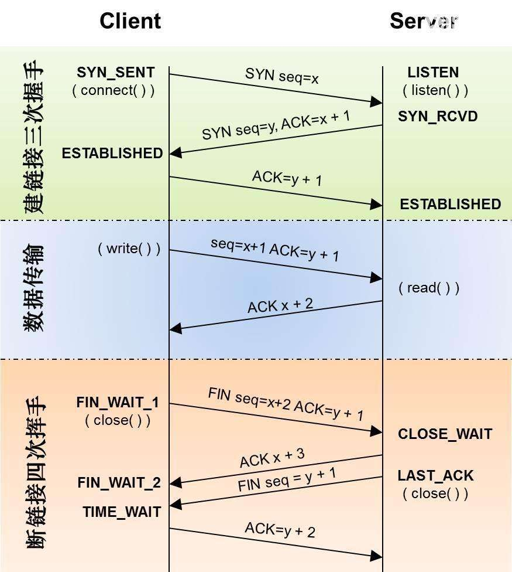

# 目录
* [tcpip模型](#tcpip模型)
* [以太网协议](#以太网协议)
* [ARP地址解析协议](#ARP地址解析协议)
* [TCP协议](#TCP协议)

## tcpip模型

<table style="text-align:center">
   <tr>
      <td>OSI模型</td>
      <td>linux tcpip模型</td>
      <td>常用协议</td>
      <td>网络设备</td>
   </tr>
   <tr>
      <td>网络层</td>
      <td rowspan="3">网络层</td>
      <td rowspan="3">telnet/DHCP/TFTP/FTP/MQTT/NFS/DNS/FTP/SNMP</td>
      <td rowspan="3"></td>
   </tr>
   <tr>
      <td>表示层</td>
   </tr>
   <tr>
      <td>会话层</td>
   </tr>
   <tr>
      <td>传输层</td>
      <td>传输层</td>
      <td>TCP/UDP</td>
      <td>四层交换机</td>
   </tr>
   <tr>
      <td>网络层</td>
      <td>网络层</td>
      <td>IP/ICMP/IGMP/ARP</td>
      <td>路由器，三层交换机</td>
   </tr>
   <tr>
      <td>数据链路层</td>
      <td rowspan="2">网络接口层</td>
      <td rowspan="2">Ethernet/PPP/PPPoE</td>
      <td>交换机（二层交换机），网桥，网卡（一半物理层，一半链路层）</td>
   </tr>
   <tr>
      <td>物理层</td>
      <td>中继器、集线器</td>
   </tr>
</table>

## 以太网协议

<table style="text-align:center">
   <tr>
      <td>前导码</td>
      <td>SFD</td>
      <td>目标地址</td>
      <td>源地址</td>
      <td>长度/类型</td>
      <td>数据</td>
      <td>CRC校验</td>
   </tr>
   <tr>
      <td>7字节</td>
      <td>1字节</td>
      <td>6字节</td>
      <td>6字节</td>
      <td>2字节</td>
      <td>46~1500字节</td>
      <td>4字节</td>
   </tr>
</table>

> 1. <strong>前导码和SFD：</strong> 不能算是以太网数据帧，是以太网在物理层上发送以太网数据时添加上去的。
> 2. <strong>长度/类型：</strong> 大于1518，表示该以太网帧中的数据属于哪个上层协议（0x0800:IP数据包；0x0806:ARP数据包）
> 3. <strong>单播地址、组播地址：</strong> 第一个字节的bit0为0代表单播地址，为1代表组播地址。

## ARP地址解析协议

<table style="text-align:center">
   <tr>
      <td>以太网首部</td>
      <td>硬件类型</td>
      <td>协议类型</td>
      <td>MAC地址长度</td>
      <td>协议地址长度</td>
      <td>OP</td>
      <td>源MAC地址</td>
      <td>源IP地址</td>
      <td>目标MAC地址</td>
      <td>目标IP地址</td>
   </tr>
   <tr>
      <td>14字节</td>
      <td>2字节</td>
      <td>2字节</td>
      <td>1字节</td>
      <td>1字节</td>
      <td>2字节</td>
      <td>6字节</td>
      <td>4字节</td>
      <td>6字节</td>
      <td>4字节</td>
   </tr>
</table>

> 1. <strong>MAC地址长度和IP地址长度：</strong> 分别为6和4.
> 2. <strong>OP：</strong>ARP请求（值为1）、ARP应答（值为2）。

## IP地址分类
IP地址=网络地址＋主机地址

|分类|开头|第一个字节范围|总体范围|掩码地址|说明|
|---|:---:|:----:|--------------|:---:|--|
|A类|0    |1~126  |1.0.0.0 - 126.255.255.255|255.0.0.0|给规模特别大的网络使用|
|B类|10   |128~191|128.0.0.0 - 191.255.255.255|255.255.0.0|给一般的中型网络|
|C类|110  |192~223|192.0.0.0 - 223.255.255.255|255.255.255.0|给小型网络|
|D类|1110 |224~239|224.0.0.0 - 239.255.255.255| - |用于多点广播（组播）|
|E类|11110|240~255|240.0.0.0 - 255.255.255.255| - |用于广播地址|

其他：
> 1. 主机号全为0表示本网络本身 主机号全为1表示本网络广播地址
> 2. 127.0.0.0 环路自检地址，表示任意主机本身
> 3. 0.0.0.0 表示本网络的本主机
> 4. 专用地址： A类：10.0.0.0—10.255.255.255，B类：172.16.0.0—172.31.255.255，C类：192.168.0.0—192.168.255.255。
> 5. IP地址与子网掩码相与得到网络号
## TCP与UDP的区别
|TCP|UDP|
|---|---|
|面向连接,需要三次握手，4次挥手|不需要建立连接 |
|无差错，不丢失，不重复，且按序到达|不保证数据可靠、按序到达|
|面向字节流|面向报文|
|有拥塞控制,不会使源主机的发送速率降低|没有拥塞控制|
|连接只能是点到点|支持一对一，一对多，多对一和多对多的交互通信|
|首部开销20字节|首部开销小，只有8个字节|
|ftp telnet http https SMTP POP3|DNS DHCP tftp IGMP RTP|

## ICMP协议
> 1. ICMP允许主机或路由报告差错情况和提供有关异常情况
> 2. ICMP是因特网的标准协议，属于IP层的协议。

### ping包

同一个局域网中： 
1. Pc1在应用层发起个目标IP位IP2的Ping请求。
2. 传输层接到上层请求的数据，将数据分段并加上UDP报头。下传到Internet层。
3. 网际层接收来处上层的数据后，根据ICMP协议进行封装，添加PC1的IP为源IP为和PC2IP为目标IP后封装成数据包。下传到网络接口层。
4. 网络接口层接收数据包后，进行封装，源MAC地址为PC1的MAC地址，目标MAC地址则查询自己的ARP缓存表获取。如果PC1 arp缓存表中没有目标IP对应的MAC地址，则PC1发出一个ARP广播报文。ARP报文中源MAC地址为Pc1mac地址，源IP地址为pc1 IP，所要请求的是PC2的IP对应的mac地址。
5. PC2收到ARP广播后，进行解封装，发现所请求的MAC地址是自己的。则PC2将PC1的mac地址写入arp缓存表中。然后向PC1发送一个 ARP应答单播。该单播消息包括目标IP为PC1ip，目标Mac为pc1mac地址，源IP为PC2的IP，源Mac为pc2的Mac。
6. Pc1接收到PC2的arp应答报文后，将Pc2的MAC地址存入arp缓存中，并将Pc2的Mac地址作为目标地址封装到数据帧中。发给下层进行网络传输。
7. PC2接收这个帧后，在网络接口层查看目标mac地址是否指向自己。是，PC2则将帧头去掉，向上层传输。
8. Pc2网际层接收到这个信息包，查看包头，发现目标IP和自己匹配，则解封装，将数据向上层传输。
9. 传输层接收来自下层的Ping请求的UDP报文，则去掉UDP报头，向应用层传送。
10. 应用层收到ping请求后，发送一个PIng回应报文给PC1

## TCP的三次握手与四次挥手过程，各个状态名称与含义，TIMEWAIT的作用
### 三次握手
* 第一次握手：客户机首先向服务器的TCP发送一个连接请求报文段，这个特殊的报文段不含应用层数据，其首部中同步位SYN被设置为1。另外，客户机会随机选择一个起始序号seq=x(连接请求报文不携带数据，但要消耗一个序号).
* 第二次握手：服务器的TCP收到连接请求报文段后，如果同意建立连接，就向客户机发回确认，并为该TCP连接分配TCP缓存和变量。在确认报文段中，SYN和ACK位都被设置为1，确认号字段值为ack=x+1,并且服务器随机产生起始序号seq=y. 确认包同样不包含应用层数据。
* 第三次握手：当客户机收到确认报文段后，还要向服务器给出确认，并且也要给该连接分配缓存和变量。这个报文段的确认为ACK被设置为1，序号段被设置为seq=x+1,确认号字段ack=y+1. 该报文段可以携带数据，如果不携带数据则不消耗序号。 理想状态下，TCP连接一旦建立，在通信双方中的任何一方主动关闭连接之前，TCP 连接都将被一直保持下去。因为TCP提供全双工通信，因此双方任何时候都可以发送数据。
### 四次挥手 
* 第一次挥手：客户机打算关闭连接，就向其TCP发送一个连接释放报文，并停止再发送数据，主动关闭TCP连接。该报文段的FIN标志位被设置为1，seq=u,它等于前面已经发送过的数据的最后一个字节的序号加1。
* 第二次挥手：服务器收到连接释放报文段后即发出确认，确认号是ack=u+1,序号为v,等于它前面已经发送过的数据的最后一个字节序号加1.此时客户机到服务器这个方向的连接就释放了，TCP处于半关闭状态。ACK=1，seq=v,ack=u+1
* 第三次挥手：若服务器已经没有要向客户机发送的数据，就通知TCP释放连接，此时发出FIN=1，确认号ack= u+1,序号seq =w,已经发送过的数据最后一个字节加1。确认为ACK=1. (FIN = 1, ACK=1,seq = w, ack =u+1) 第四次挥手：客户机收到连接释放报文段后，必须发出确认。在确认报文段中，确认位ACK=1，序号seq=u+1,确认号ack=w+1. 此时连接还没有释放掉，必须经过实践等待计时器设置的时间2MSL(Max Segment Lifetime),后，客户机才进入连接关闭状态。 (ACK=1,seq=u+1,ack=w+1)
如下图所示：

### tcp协议图解



## 为什么会采用三次握手，若采用二次握手可以吗？
采用三次握手是为了防止失效的连接请求报文段再次传到服务器，因而产生错误。如果由于网络不稳定，虽然客户端以前发送的连接请求以到达服务方，但服务方的同意连接的应答未能到达客户端。则客户方要重新发送连接请求，若采用二次握手，服务方收到客服端重传的请求连接后，会以为是新的请求，就会发送同意连接报文，并新开进程提供服务，这样会造成服务方资源的无谓浪费。 如果只采用一次的话，客户端不知道服务端是否已经收到自己发送的数据，则会不断地发送数据。为了保证服务端能收接受到客户端的信息并能做出正确的应答而进行前两次(第一次和第二次)握手，为了保证客户端能够接收到服务端的信息并能做出正确的应答而进行后两次(第二次和第三次)握手

## 为什么四次挥手，主动方要等待２MSL后才关闭连接．
一、保证TCP协议的全双工连接能够可靠关闭． 主要为了确保对方能受到ACK信息. 如果Client直接CLOSED了，那么由于IP协议的不可靠性或者是其它网络原因，导致Server没有收到Client最后回复的ACK。那么Server就会在超时之后继续发送FIN，此时由于Client已经CLOSED了，就找不到与重发的FIN对应的连接，最后Server就会收到RST而不是ACK，Server就会以为是连接错误把问题报告给高层。所以，Client不是直接进入CLOSED，而是要保持2MSL,如果在这个时间内又收到了server的关闭请求时可以进行重传，否则说明server已经受到确认包则可以关闭.

## TCP拥塞控制

为了更好对TCP进行拥塞控制，因特网建议标准定义了以下四种算法：慢开始，拥塞避免，快重传，快恢复。 首先在TCP要求发送端维护两个窗口： 1） 接收窗口rwnd，接收方根据当前缓存大小锁许诺的最新窗口值。 2) 拥塞窗口 cwnd ,发送方根据自己估算的网络拥塞程度而设置的窗口值。 发送窗口的上限是取这两者的最小值。 慢开始： TCP刚连接好时，先令拥塞窗口cwnd =1 ,在每次收到一个对新报文段的确认时将cwnd加1. Cwnd的大小呈指数增长。 拥塞避免算法： 当cwnd大于等于慢开始门限ssthresh时，cwnd窗口每次加1而不是加倍。当发送方检测到超时事件的发生时，就将慢开始门限设置为当前cwnd的一半，同时将cwnd设置为1. 这样的目的是迅速减少主机发送到网络的分组数，使得发生拥塞的路由器有足够的时间吧队列中积压的分组处理完毕。 快重传：当发送方连续收到三个重复的ACK报文时，直接重传对方尚未收到的报文段，而不必等待那个报文段设置的重传计时器超时。 快恢复：当发送端收到连续三个冗余的ACK时，就执行“乘法减小”算法，把慢开始门限ssthresh减半，cwnd设置为慢开始门限减半后的数值（与慢开始不同）。

## TCP滑动窗口与回退N针协议

滑动窗口： 发送方都维持一组连续的允许发送的帧的序号称为发送窗口。同时接收方也维持一组连续的允许接收的帧序号，称为接收窗口。发送窗口是用来对发送方进行流量控制，接收窗口是用来控制接收那些数据帧不可以接收那些帧。 在发送端，收到一个确认帧，发送窗口就向前滑动一个帧位置，当发送窗口没有可以发送的帧时，发送方就停止发送。直到接收方发送的确认帧使发送窗口向前移动。 在接收端，只有收到数据帧的序号落在接收窗口内才将该帧收下，否则一律丢弃。每收到一个帧后就发送回确认帧。
后退N帧协议 发送窗口大于1，接收窗口等于1.在后退N帧中，发送方不需要收到上一帧的ACK后才能发送下一帧，而是可以连续发送帧。当接收方检测出失序信息帧后，要求发送方重发最后一个正确接收的帧之后的所有未被确认的帧。源站每发完一帧就要为该帧设置超时计时器，如果在超时时间内没有收到确认帧则进行重发。服务端会采用累积确认的方式，不是每个帧都发确认，可以连续收到好几个正确帧后发回一个确认信息。接收方因为窗口为1，所以必须按序接收数据帧，如果某个序大于当前所期望的序号时就会连续发送3个ACK确认帧，要求客户端重传失序帧。

## TCP的可靠性如何保证

在TCP的连接中，数据流必须以正确的顺序送达对方。TCP的可靠性是通过顺序编号和确认（ACK）来实现的。TCP在开始传送一个段时，为准备重传而首先将该段插入到发送队列之中，同时启动时钟。其后，如果收到了接受端对该段的ACK信息，就将该段从队列中删去。如果在时钟规定的时间内，ACK未返回，那么就从发送队列中再次送出这个段。TCP在协议中就对数据可靠传输做了保障，握手与断开都需要通讯双方确认，数据传输也需要双方确认成功，在协议中还规定了：分包、重组、重传等规则；而UDP主要是面向不可靠连接的，不能保证数据正确到达目的地。

## 各种协议对应的传输层协议

|Ethernet应用|IP   |ICMP |UDP  |TCP  |SCIP|
|-----------|:---:|:---:|:---:|:---:|:---:|
|ping       |      |     |  ●  |     |     |
|traceroute |      |     |  ●  |  ●  |     |
|OSPF(路由协议)|  ● |     |     |     |     |
|RIP(路由协议) |    |     |  ●  |     |     |
|BGP(路由协议) |    |     |     |  ●  |     |
|BOOTP(引导协议)|   |     |  ●  |     |     |
|DHCP       |      |  ●  |     |     |     |
|NTP(时间协议)|     |  ●  |    |     |     |
|TFTP(低级FTP)|    |  ●  |     |     |     |
|SNMP(网络管理)|    |  ●  |     |     |     |
|IGMP(组播管理)|    |  ●  |     |     |     |
|SMTP(电子邮件)|    |     |     |  ●  |     |
|telnet(远程登录)|  |     |     |  ●  |     |
|SSH(安全远程登录)|  |     |     |  ●  |     |
|FTP(文件传输)|     |     |     |  ●  |     |
|HTTP(web)|        |     |     |  ●  |     |
|NNTP(网络新闻)|    |     |     |  ●  |     |
|LPR(远程打印)|     |     |     |  ●  |     |
|DNS(域名系统)|     |     |  ●  |  ●  |     |
|NFS(网络文件系统)|  |     |  ●  |  ●  |     |
|Sun RPC(远程过程调用)||   |  ●  |  ●  |     |
|DCE RPC(远程过程调用)||   |  ●  |  ●  |     |
|IUA(ISDN)|        |     |     |     |  ●  |
|M2UA/M3UA(SS7电话信令)|| |     |     |  ●  |
|H.248(媒体网关控制)||     |  ●  |  ●  |  ●  |
|H.323(IP电话)|     |     |  ●  |  ●  |  ●  |
|H.248(IP电话)|     |     |  ●  |  ●  |  ●  |
## MQTT协议
https://mcxiaoke.gitbooks.io/mqtt-cn/content/mqtt/04-OperationalBehavior.html
### MQTT有3种网络连接方式
tcp TLS websocket
### 主题过滤器 Topic Filter
订阅中包含的一个表达式，用于表示相关的一个或多个主题。主题过滤器可以使用通配符。
### 控制报文 MQTT Control Packet
通过网络连接发送的信息数据包。MQTT规范定义了十四种不同类型的控制报文
名字	值	报文流动方向	描述
Reserved	0	禁止	保留
CONNECT	1	客户端到服务端	客户端请求连接服务端
CONNACK	2	服务端到客户端	连接报文确认
PUBLISH	3	两个方向都允许	发布消息
PUBACK	4	两个方向都允许	QoS 1消息发布收到确认
PUBREC	5	两个方向都允许	发布收到（保证交付第一步）
PUBREL	6	两个方向都允许	发布释放（保证交付第二步）
PUBCOMP	7	两个方向都允许	QoS 2消息发布完成（保证交互第三步）
SUBSCRIBE	8	客户端到服务端	客户端订阅请求
SUBACK	9	服务端到客户端	订阅请求报文确认
UNSUBSCRIBE	10	客户端到服务端	客户端取消订阅请求
UNSUBACK	11	服务端到客户端	取消订阅报文确认
PINGREQ	12	客户端到服务端	心跳请求
PINGRESP	13	服务端到客户端	心跳响应
DISCONNECT	14	客户端到服务端	客户端断开连接
Reserved	15	禁止	保留
### 大端模式
> MQTT数据格式使用大端模式存放
### MQTT控制报文结构
固定报头 + 可变报头 + payload
#### 固定报头
2-5个字节
第一个字节  0-3bit 表示控制报文类型的标志位 4-7bit 表示控制报文类型
第2-5字节 剩余长度 表示当前报文剩余部分的字节数，包括可变报头和payload的数据。
#### 剩余长度
> 剩余长度字段使用一个变长度编码方案，对小于128的值它使用单字节编码。更大的值按下面的方式处理。低7位有效位用于编码数据，最高有效位用于指示是否有更多的字节。因此每个字节可以编码128个数值和一个延续位（continuation bit）。剩余长度字段最大4个字节。

字节数	最小值	最大值
1	0 (0x00)	127 (0x7F)
2	128 (0x80, 0x01)	16 383 (0xFF, 0x7F)
3	16 384 (0x80, 0x80, 0x01)	2 097 151 (0xFF, 0xFF, 0x7F)
4	2 097 152 (0x80, 0x80, 0x80, 0x01)	268 435 455 (0xFF, 0xFF, 0xFF, 0x7F)

变长编码方案代码：
```c
   do
  encodedByte = X MOD 128
  X = X DIV 128
 // if there are more data to encode, set the top bit of this byte
 if ( X > 0 )
     encodedByte = encodedByte OR 128
 endif
     'output' encodedByte
while ( X > 0 )
```

变长解码方案代码：
```c
multiplier = 1
value = 0
do
    encodedByte = 'next byte from stream'
    value += (encodedByte AND 127) * multiplier
    multiplier *= 128
    if (multiplier > 128*128*128)
       throw Error(Malformed Remaining Length)
while ((encodedByte AND 128) != 0)
```
### 可变报头 Variable header
> 某些MQTT控制报文包含一个可变报头部分。它在固定报头和负载之间。可变报头的内容根据报文类型的不同而不同。可变报头的报文标识符（Packet Identifier）字段存在于在多个类型的报文里。
### 报文标识符 Packet Identifier
> 很多控制报文的可变报头部分包含一个两字节的报文标识符字段。这些报文是PUBLISH（QoS > 0时）， PUBACK，PUBREC，PUBREL，PUBCOMP，SUBSCRIBE, SUBACK，UNSUBSCIBE，UNSUBACK。
SUBSCRIBE，UNSUBSCRIBE和PUBLISH（QoS大于0）控制报文必须包含一个非零的16位报文标识符（Packet Identifier）[MQTT-2.3.1-1]。客户端每次发送一个新的这些类型的报文时都必须分配一个当前未使用的报文标识符 [MQTT-2.3.1-2]。如果一个客户端要重发这个特殊的控制报文，在随后重发那个报文时，它必须使用相同的标识符。当客户端处理完这个报文对应的确认后，这个报文标识符就释放可重用。QoS 1的PUBLISH对应的是PUBACK，QoS 2的PUBLISH对应的是PUBCOMP，与SUBSCRIBE或UNSUBSCRIBE对应的分别是SUBACK或UNSUBACK [MQTT-2.3.1-3]。发送一个QoS 0的PUBLISH报文时，相同的条件也适用于服务端 [MQTT-2.3.1-4]。
QoS等于0的PUBLISH报文不能包含报文标识符 [MQTT-2.3.1-5]。
PUBACK, PUBREC, PUBREL报文必须包含与最初发送的PUBLISH报文相同的报文标识符 [MQTT-2.3.1-6]。类似地，SUBACK和UNSUBACK必须包含在对应的SUBSCRIBE和UNSUBSCRIBE报文中使用的报文标识符 [MQTT-2.3.1-7]。
### payload
> 某些MQTT控制报文在报文的最后部分包含一个有效载荷，这将在第三章论述。对于PUBLISH来说有效载荷就是应用消息。

控制报文	有效载荷
CONNECT	需要
CONNACK	不需要
PUBLISH	可选
PUBACK	不需要
PUBREC	不需要
PUBREL	不需要
PUBCOMP	不需要
SUBSCRIBE	需要
SUBACK	需要
UNSUBSCRIBE	需要
UNSUBACK	不需要
PINGREQ	不需要
PINGRESP	不需要
DISCONNECT	不需要
